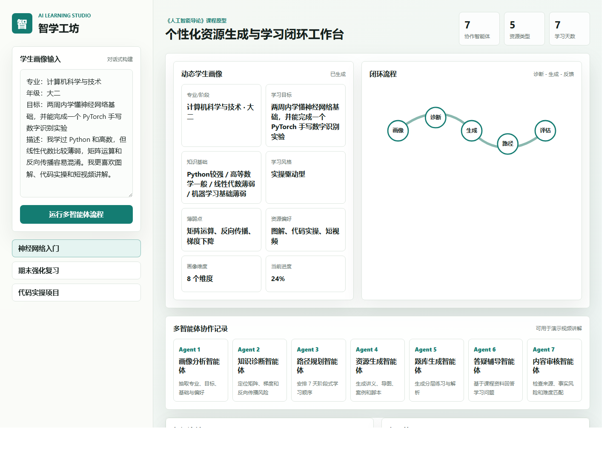
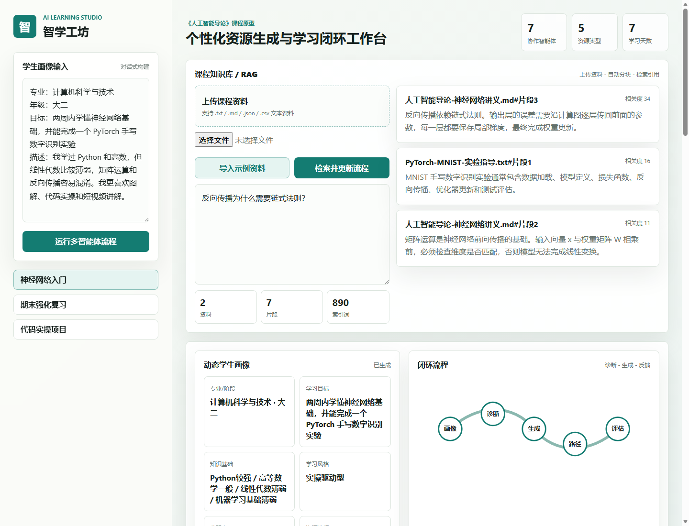
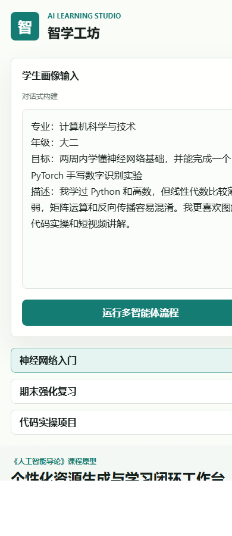
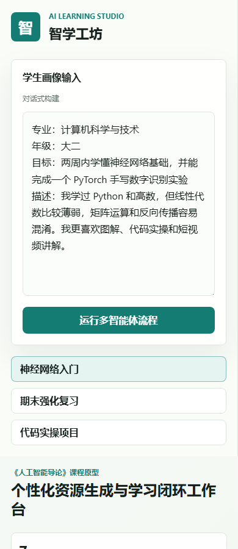

# Demo Guide

This guide explains how to show the current prototype to users, teachers, or open source contributors.

## Start the app

```bash
npm test
npm run serve
```

Open:

```text
http://localhost:5173
```

## Desktop flow



1. Select the neural network learning scenario.
2. Review the generated student profile.
3. Import sample course documents in the RAG panel.
4. Ask: `反向传播为什么需要链式法则？`
5. Run retrieval and inspect citation labels.
6. Run the multi-agent workflow.
7. Review resources, learning path, tutor answer, and evaluation.

## RAG flow



The RAG prototype runs in the browser:

- Uploaded files are parsed locally.
- Text is chunked and indexed in memory.
- Retrieval returns Top-K chunks with source labels.
- Retrieved chunks are injected into resource generation, tutor answers, and content review.

## Mobile flow



The mobile view keeps the system usable for quick demos:

- Scenario selection remains visible.
- Cards stack vertically.
- RAG and agent outputs remain readable.



## Demo script

Use this short narrative:

> 智学工坊把一个学生的目标、基础和偏好转化成动态画像，再结合课程资料 RAG 检索，让 7 个学习智能体协作生成讲义、练习、代码案例、PPT/视频脚本、学习路径、答疑和学习评估。整个原型在本地浏览器运行，适合课程演示和后续接入真实大模型 API。
